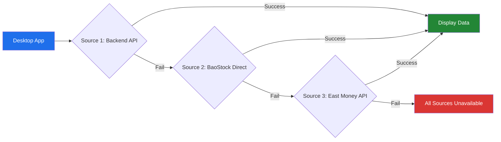

<div align="center">


[](https://github.com/sjkncs/infortune-ai-desktop)

<br/>

<a href="https://github.com/sjkncs/infortune-ai-desktop/releases/latest"></a>
<a href="https://github.com/sjkncs/infortune-ai-desktop/stargazers"></a>
<a href="https://github.com/sjkncs/infortune-ai-desktop/network/members"></a>
<a href="https://github.com/sjkncs/infortune-ai-desktop/blob/master/LICENSE"></a>

<br/>


<br/><br/>

<a href="#-quick-start">Quick Start</a>&nbsp;&nbsp;|&nbsp;&nbsp;<a href="#-whats-new-in-v100">What's New</a>&nbsp;&nbsp;|&nbsp;&nbsp;<a href="#-multi-model-ai-engine">AI Models</a>&nbsp;&nbsp;|&nbsp;&nbsp;<a href="#-real-time-market-data">Market Data</a>&nbsp;&nbsp;|&nbsp;&nbsp;<a href="#-architecture">Architecture</a>&nbsp;&nbsp;|&nbsp;&nbsp;<a href="#-api-reference">API</a>

</div>

<br/>

> [!NOTE]
> **In Fortune AI** is a professional AI-powered stock analysis platform featuring a desktop client (Electron) and a web app (Vue 3). It integrates **20+ AI models** (Gemini, GPT, Grok), **real-time Chinese A-share market data** via BaoStock & East Money, strategy backtesting, and portfolio management.

> [!TIP]
> Based on [@QoneFeng](https://github.com/QoneFeng)'s open-source project **[InFortune.ai](https://github.com/QoneFeng/InFortune.ai)**, extensively enhanced with a full Electron desktop app, multi-model AI support, and real-time data integration.

---

## 🚀 What's New in v1.0.0

<table>
<tr>
<td width="50%">

### 🤖 Multi-Model AI Engine
- **20+ AI models** with in-chat model selector
- Gemini 2.5/3 Pro & Flash (dialogue, search, tool-calling)
- GPT-4o, GPT-5, GPT-5.2, Grok-4
- Image generation (Gemini Flash/Pro)
- Model selection persisted per session

</td>
<td width="50%">

### 📈 Real-Time Market Data
- **3-tier data fallback**: Backend → BaoStock → East Money
- Shanghai Composite, Shenzhen Component, ChiNext, CSI 300
- BaoStock direct K-line fetching (port 8001)
- East Money free API for real-time index quotes
- Auto-refresh with configurable intervals

</td>
</tr>
<tr>
<td width="50%">

### 💬 Enhanced Chat Interface
- File upload (images, PDF, Excel, CSV, Markdown)
- Voice input via Web Speech API
- Chat history with timestamps (like Doubao/Qwen)
- Categorized model dropdown with descriptions

</td>
<td width="50%">

### 🖥️ Desktop App Improvements
- Fixed Windows keyboard input/IME in Electron
- Updated CSP for multi-source data access
- Role-based Electron menus for full compatibility
- Detached DevTools to prevent focus stealing

</td>
</tr>
</table>

---

## 🤖 Multi-Model AI Engine

In Fortune AI integrates **20+ AI models** across 5 categories, selectable directly from the chat interface:

<div align="center">

```
┌──────────────────────────────────────────────────────────┐
│  🤖 Model Selector                              ▼       │
├──────────────────────────────────────────────────────────┤
│  💬 DIALOGUE    │ Gemini 3 Flash / 2.5 Pro / 3 Pro      │
│  🔍 SEARCH      │ Gemini 3 Pro Search / 2.5 Flash Search│
│  🔧 TOOL-CALL   │ Gemini 3 Pro (Tool) / 2.5 Flash (Tool)│
│  🤖 GPT / GROK  │ GPT-5 / GPT-4o / GPT-5.2 / Grok-4    │
│  🎨 IMAGE GEN   │ Gemini Flash 生图 / Gemini Pro 生图    │
└──────────────────────────────────────────────────────────┘
```

</div>

<details>
<summary><b>📋 Complete Model Catalog (click to expand)</b></summary>

<br/>

| Category | Model ID | Name | Description |
|:--------:|:---------|:-----|:------------|
| 💬 Dialogue | `gemini-3-flash` | Gemini 3 Flash | Best cost-performance, half the price of 2.5 Pro |
| 💬 Dialogue | `gemini-2.5-pro` | Gemini 2.5 Pro | 1M context, built-in chain-of-thought + search |
| 💬 Dialogue | `gemini-3-pro` | Gemini 3 Pro | Latest Pro model, slightly higher cost |
| 💬 Dialogue | `gemini-2.5-flash` | Gemini 2.5 Flash | Fast response model |
| 🔍 Search | `gemini-3-pro-search` | Gemini 3 Pro Search | Real-time web search built-in |
| 🔍 Search | `gemini-2.5-pro-search` | Gemini 2.5 Pro Search | Real-time web search built-in |
| 🔍 Search | `gemini-2.5-flash-search` | Gemini 2.5 Flash Search | Fast search model (default) |
| 🔍 Search | `gemini-3-flash-search` | Gemini 3 Flash Search | Fast search model |
| 🔧 Tool | `gemini-3-pro-no` | Gemini 3 Pro (Tool) | Search disabled, custom tools supported |
| 🔧 Tool | `gemini-2.5-pro-no` | Gemini 2.5 Pro (Tool) | Search disabled, custom tools supported |
| 🔧 Tool | `gemini-2.5-flash-no` | Gemini 2.5 Flash (Tool) | Search disabled, custom tools supported |
| 🔧 Tool | `gemini-3-flash-no` | Gemini 3 Flash (Tool) | Search disabled, custom tools supported |
| 🤖 GPT | `gpt-5` | GPT-5 | OpenAI's latest flagship |
| 🤖 GPT | `gpt-4o` | GPT-4o | OpenAI multimodal model |
| 🤖 GPT | `gpt-5.2` | GPT-5.2 | OpenAI advanced version |
| 🤖 GPT | `grok-4` | Grok-4 | xAI Grok model |
| 🎨 Image | `gemini-2.5-flash-image-preview` | Gemini Flash Image Gen | ~$0.01/image, English prompts recommended |
| 🎨 Image | `gemini-3-pro-image-preview` | Gemini Pro Image Gen | High-quality, ~$0.04/image |

</details>

> [!IMPORTANT]
> The model selector remembers your last choice via `localStorage`. The selected model is sent to the backend `/api/chat` endpoint as the `model` parameter. All models are served through the **HiAPI** unified gateway (`https://hiapi.online/v1`).

---

## 📈 Real-Time Market Data

Market data uses a **3-tier fallback architecture** for maximum reliability:



<div align="center">

| Source | URL | Data Type | Latency |
|:------:|:----|:----------|:-------:|
| **Backend Proxy** | `localhost:3001/api/market/overview` | Aggregated indices | ~200ms |
| **BaoStock Direct** | `127.0.0.1:8001/api/kline/history` | Daily K-line (OHLCV) | ~500ms |
| **East Money** | `push2.eastmoney.com` | Real-time quotes | ~300ms |

</div>

<details>
<summary><b>📊 Supported Indices</b></summary>

| Index | Code | BaoStock Code | East Money SecID |
|:------|:----:|:-------------|:-----------------|
| Shanghai Composite (上证指数) | `000001` | `sh.000001` | `1.000001` |
| Shenzhen Component (深证成指) | `399001` | `sz.399001` | `0.399001` |
| ChiNext (创业板指) | `399006` | `sz.399006` | `0.399006` |
| CSI 300 (沪深300) | `000300` | `sh.000300` | `1.000300` |

</details>

---

## 🖥️ Desktop Application

### 10 View Modules

<div align="center">

| # | Module | View ID | Description |
|:-:|:-------|:-------:|:------------|
| 1 | 🤖 **Smart Analysis** | `chat` | AI-powered chat with model selector, file upload, voice input |
| 2 | 📈 **Market Overview** | `market` | Real-time indices with multi-source data fallback |
| 3 | 📊 **Stock Analysis** | `stock` | Individual stock search and fundamental/technical analysis |
| 4 | ⭐ **Watchlist** | `zixuan` | Custom stock watchlist with real-time monitoring |
| 5 | 💼 **Portfolio** | `portfolio` | Holdings management with P&L tracking |
| 6 | 📉 **Index Analysis** | `zhishu` | Index valuation (PE/PB percentile analysis) |
| 7 | 📦 **ETF Market** | `etf` | ETF listings with search, sort by volume/change/amount |
| 8 | 🧪 **Strategy Backtest** | `strategy` | MA/MACD/KDJ/RSI/Bollinger strategies with equity curves |
| 9 | 🔀 **Mode Switch** | `mode` | Toggle between Local and Web modes |
| 10 | ⚙️ **Settings** | `settings` | 8 setting panels: General, Appearance, Language, Data, etc. |

</div>

### Chat Interface Features

```
┌─────────────────────────────────────────────────────────────┐
│  📜 Chat History (sidebar)          │  Welcome / Messages   │
│  ─────────────────────              │                       │
│  💬 贵州茅台分析  14:30             │  [Model: Gemini 2.5]  │
│  💬 市场行情概览  13:15             │  ┌─────────────────┐  │
│  💬 技术指标讨论  11:20             │  │ 🤖 Model Selector│  │
│                                     │  └─────────────────┘  │
│                                     │  ┌─────────────────┐  │
│                                     │  │📎 [text] 🎤 ➤  │  │
│                                     │  └─────────────────┘  │
│                                     │  [实时数据][技术][新闻]│
└─────────────────────────────────────────────────────────────┘
```

- **Model Selector** — categorized dropdown above input, persistent selection
- **File Upload** — images, PDF, Word, Excel, CSV, Markdown
- **Voice Input** — Web Speech API with recording indicator
- **Chat History** — timestamped conversations saved to localStorage

---

## 🏗️ Architecture

<div align="center">

```
                          ┌─────────────────────┐
                          │   Electron Desktop   │
                          │    (main.js + UI)    │
                          └──────────┬──────────┘
                                     │
              ┌──────────────────────┼──────────────────────┐
              │                      │                      │
     ┌────────▼────────┐   ┌────────▼────────┐   ┌────────▼────────┐
     │  Vue 3 Web App  │   │  Express Backend │   │  Admin Panel    │
     │  :5173           │   │  :3001           │   │  :5174          │
     └─────────────────┘   └────────┬─────────┘   └─────────────────┘
                                    │
                    ┌───────────────┼───────────────┐
                    │               │               │
           ┌────────▼──────┐ ┌─────▼──────┐ ┌──────▼───────┐
           │ HiAPI Gateway │ │  BaoStock  │ │  East Money  │
           │ (AI Models)   │ │  :8001     │ │   (Free API) │
           └───────────────┘ └────────────┘ └──────────────┘
                    │
        ┌───────────┼───────────┐
        │           │           │
   ┌────▼───┐ ┌────▼───┐ ┌────▼───┐
   │ Gemini │ │  GPT   │ │  Grok  │
   │ 2.5/3  │ │ 4o/5   │ │   4    │
   └────────┘ └────────┘ └────────┘
```

</div>

### Service Ports

| Service | Port | Technology | Purpose |
|:--------|:----:|:-----------|:--------|
| **Desktop App** | — | Electron 28 | Native desktop client |
| **Web Frontend** | `5173` | Vue 3 + Vite + TailwindCSS | Web interface |
| **Admin Panel** | `5174` | Vue 3 + Vite | Data management |
| **API Server** | `3001` | Express + LowDB + WebSocket | REST API + real-time push |
| **AKShare Service** | `8000` | FastAPI + AKShare | Multi-market stock data |
| **BaoStock Service** | `8001` | FastAPI + BaoStock | A-share financial data |
| **ML Service** | `8002` | Python | Stock prediction inference |

---

## ⚡ Quick Start

### Prerequisites

```
Node.js >= 18.0.0  |  Python >= 3.11  |  npm >= 9.0.0
```

### 1. Clone & Install

```bash
git clone https://github.com/sjkncs/infortune-ai-desktop.git
cd infortune-ai-desktop

# Desktop app
cd desktop-app && npm install

# Backend server
cd ../website && npm install

# BaoStock service (optional)
cd ../baostock && pip install -r requirements.txt
```

### 2. Configure

```bash
# Copy and edit .env
cp .env.example .env
```

```env
AI_API_KEY=your_hiapi_key_here
AI_API_BASE_URL=https://hiapi.online/v1
AI_MODEL=gemini-2.5-flash-search
BAOSTOCK_API_URL=http://127.0.0.1:8001
```

### 3. Run

<table>
<tr><th>Terminal</th><th>Command</th><th>Service</th></tr>
<tr><td>1</td><td><code>cd website && npm run server</code></td><td>Backend API :3001</td></tr>
<tr><td>2</td><td><code>cd baostock && python app.py</code></td><td>BaoStock :8001</td></tr>
<tr><td>3</td><td><code>cd desktop-app && npm start</code></td><td>Desktop App</td></tr>
</table>

### 4. Build for Distribution

```bash
cd desktop-app
npm run build:win     # Windows (portable + zip)
# Output: dist/InFortuneAI-1.0.0-win-x64.exe
```

---

## 📡 API Reference

<details>
<summary><b>🔵 Core APIs — Node.js Backend (:3001)</b></summary>

<br/>

| Method | Endpoint | Description |
|:------:|:---------|:------------|
| `POST` | `/api/chat` | AI chat (accepts `model` param from frontend) |
| `GET` | `/api/market/overview` | Market indices overview |
| `GET` | `/api/search?keyword=` | Stock search (fuzzy match) |
| `GET` | `/api/stocks` | Stock list with real-time prices + MA |
| `GET` | `/api/portfolio` | Portfolio holdings with prices |
| `POST` | `/api/save-portfolio` | Save portfolio data |
| `GET` | `/api/stock/:code` | Stock detail (orderbook, valuation) |
| `GET` | `/api/stock/:code/kline` | K-line data (multi-period) |
| `GET` | `/api/stock/:code/realtime` | Single stock real-time quote |
| `GET` | `/api/indices/realtime?codes=` | Batch index real-time quotes |
| `GET` | `/api/etf` | ETF list via BaoStock |
| `GET` | `/api/valuation` | Index valuation (PE/PB) |
| `POST` | `/api/backtest` | Strategy backtesting |
| `POST` | `/api/ml/predict` | ML stock prediction |
| `GET` | `/api/health` | Health check |

</details>

<details>
<summary><b>🟢 BaoStock APIs (:8001)</b></summary>

<br/>

| Endpoint | Description |
|:---------|:------------|
| `/api/stock/list` | A-share stock listing |
| `/api/etf/list` | ETF fund listing |
| `/api/kline/history?code=&start_date=&end_date=&frequency=` | Historical K-line (daily/weekly/monthly) |
| `/api/finance/profit/{code}` | Profitability (ROE, net margin, gross margin) |
| `/api/finance/growth/{code}` | Growth metrics |
| `/api/finance/balance/{code}` | Balance sheet ratios |
| `/api/finance/cash-flow/{code}` | Cash flow statement |
| `/api/finance/dupont/{code}` | DuPont analysis |
| `/api/macro/deposit-rate` | Deposit interest rates |
| `/api/macro/money-supply` | Money supply (M0/M1/M2) |

</details>

<details>
<summary><b>🟡 AKShare APIs (:8000)</b></summary>

<br/>

| Endpoint | Description |
|:---------|:------------|
| `/api/a/stock/realtime/{symbol}` | A-share real-time quote |
| `/api/a/stock/history/{symbol}` | A-share historical K-line |
| `/api/a/stock/list` | A-share stock list |
| `/api/hk/stock/*` | Hong Kong stocks |
| `/api/us/stock/*` | US stocks |
| `/api/etf/*` | ETF data |
| `/api/index/*` | Index data |

</details>

---

## 📁 Project Structure

<details>
<summary><b>📂 Click to expand full directory tree</b></summary>

```
infortune-ai-desktop/
├── 📁 desktop-app/              # Electron Desktop Application
│   ├── main.js                  #   Main process (window, menu, tray)
│   ├── preload.js               #   Preload script (context bridge)
│   ├── index.html               #   Main window (10 view containers)
│   ├── package.json             #   Electron + electron-builder config
│   ├── 📁 scripts/              #   Frontend modules
│   │   ├── app.js               #     App init, routing, model selector
│   │   ├── api.js               #     AI API calls (multi-model)
│   │   ├── api-config.js        #     MODEL_CATALOG + provider configs
│   │   ├── api-client.js        #     HTTP client with retry/stream
│   │   ├── chat.js              #     Chat UI logic
│   │   ├── market.js            #     Market data (3-source fallback)
│   │   ├── stock.js             #     Stock analysis module
│   │   ├── portfolio.js         #     Portfolio management
│   │   ├── zixuan.js            #     Watchlist module
│   │   ├── zhishu.js            #     Index valuation
│   │   ├── etf.js               #     ETF market module
│   │   ├── strategy.js          #     Strategy backtesting
│   │   ├── settings.js          #     Settings panel logic
│   │   └── i18n.js              #     Internationalization
│   └── 📁 styles/               #   CSS modules (CSS custom properties)
│       ├── main.css, chat.css, views.css, strategy.css,
│       ├── stock.css, portfolio.css, market.css,
│       ├── mode.css, settings.css
│
├── 📁 website/                  # Vue 3 Web Application
│   ├── 📁 src/
│   │   ├── 📁 views/            #   Home, Zixuan, Chicang, Zhishu,
│   │   │                        #   ETF, StockDetail, NotFound
│   │   ├── 📁 router/           #   Vue Router (7 routes)
│   │   ├── 📁 composables/      #   useStockApi, useAiAnalysis, etc.
│   │   └── 📁 components/       #   AppHeader, AppFooter
│   └── 📁 server/               # Express.js Backend
│       ├── index.js             #   30+ API endpoints
│       ├── stock-service.js     #   East Money data fetcher
│       ├── websocket-service.js #   Real-time push service
│       └── 📁 data/db.json      #   LowDB JSON storage
│
├── 📁 admin/                    # Admin Panel (Vue 3)
├── 📁 baostock/                 # BaoStock Python API (FastAPI)
├── 📁 akshare/                  # AKShare Python API (FastAPI)
├── 📁 ml_services/              # ML Inference (backtest, prediction)
├── 📁 docs/                     # 20+ documentation files
└── 📁 configs/                  # Training configs
```

</details>

---

## 📊 Feature Comparison

<div align="center">

| Feature | Web App | Desktop App | Notes |
|:--------|:-------:|:-----------:|:------|
| 📈 Real-time Market Data | ✅ | ✅ | 3-source fallback on desktop |
| 🤖 AI Chat (20+ models) | — | ✅ | **Desktop exclusive** |
| 🎯 Model Selector UI | — | ✅ | **Desktop exclusive** |
| 📎 File Upload in Chat | — | ✅ | **Desktop exclusive** |
| 🎙️ Voice Input | — | ✅ | **Desktop exclusive** |
| 💼 Portfolio Management | ✅ | ✅ | |
| ⭐ Watchlist | ✅ | ✅ | |
| 📊 Index Valuation | ✅ | ✅ | |
| 📦 ETF Market | ✅ | ✅ | |
| 🧪 Strategy Backtesting | ✅ | ✅ | 5 strategies: MA/MACD/KDJ/RSI/BB |
| 🔍 Smart Stock Search | ✅ | ✅ | |
| 🎨 Theme Customization | — | ✅ | 6 colors + dark/light/auto |
| 🌍 Multi-language | — | ✅ | CN/TW/EN/JP |
| 📱 System Tray | — | ✅ | **Desktop exclusive** |
| 🎛️ Admin Panel | ✅ | — | Web exclusive |

</div>

---

## 📝 Changelog

### v1.0.0 (2026-02-24) — In Fortune AI Release

> [!NOTE]
> Project renamed from JiuCai (久财) to **In Fortune AI**. Complete codebase rebranding across 76+ files.

**🤖 Multi-Model AI**
- 20+ models across 5 categories (Dialogue, Search, Tool-calling, GPT/Grok, Image Gen)
- In-chat model selector with categorized dropdown
- Backend `/api/chat` now accepts dynamic `model` parameter

**📈 Market Data Integration**
- BaoStock direct connection for A-share index K-line data
- East Money free API for real-time index quotes
- 3-tier fallback architecture (Backend → BaoStock → East Money)

**💬 Chat Enhancements**
- File upload support (images, PDF, Word, Excel, CSV, Markdown)
- Voice input via Web Speech API
- Chat history with timestamps, persisted to localStorage

**🖥️ Desktop Fixes**
- Fixed Windows keyboard input/IME in Electron (menu + focus fixes)
- Updated CSP for multi-origin data access
- Increased API timeout to 60s, max_tokens to 8000

---

## 🤝 Contributing

1. **Fork** this repository
2. Create a feature branch: `git checkout -b feature/amazing-feature`
3. Commit changes: `git commit -m 'Add amazing feature'`
4. Push: `git push origin feature/amazing-feature`
5. Open a **Pull Request**

> [!TIP]
> Check [docs/INDEX.md](docs/INDEX.md) for the full documentation index with 20+ guides.

---

## 🙏 Credits

<table>
<tr>
<td align="center"><a href="https://github.com/QoneFeng"><b>@QoneFeng</b></a><br/>Original InFortune.ai project</td>
<td align="center"><a href="https://github.com/sjkncs"><b>@sjkncs</b></a><br/>Desktop app & multi-model integration</td>
</tr>
</table>

**Built with:** [Electron](https://www.electronjs.org/) · [Vue.js](https://vuejs.org/) · [FastAPI](https://fastapi.tiangolo.com/) · [BaoStock](http://www.baostock.com) · [AKShare](https://www.akshare.xyz/) · [TailwindCSS](https://tailwindcss.com/) · [ECharts](https://echarts.apache.org/)

---

## 📄 License

This project is licensed under the [MIT License](LICENSE).

---

<div align="center">


<br/>

**Made with ❤️ by [Yangting SONG](https://github.com/sjkncs)**

<sub>Mathematics is the language of nature</sub>

<br/>

<a href="https://github.com/sjkncs/infortune-ai-desktop"></a>
<a href="https://github.com/sjkncs/infortune-ai-desktop/fork"></a>
<a href="https://github.com/sjkncs/infortune-ai-desktop/issues"></a>

</div>
